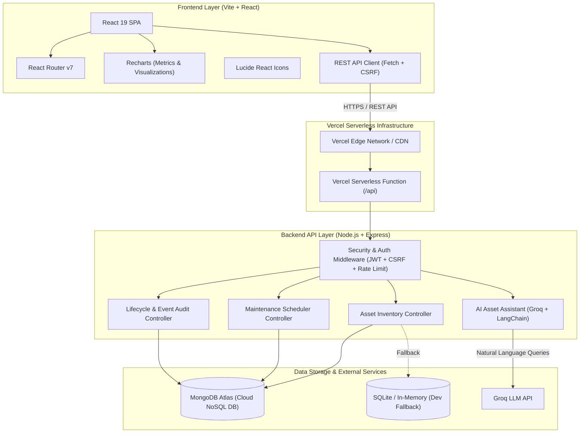
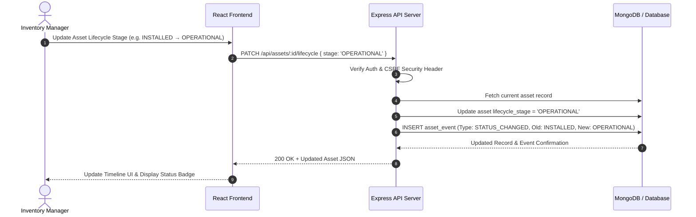
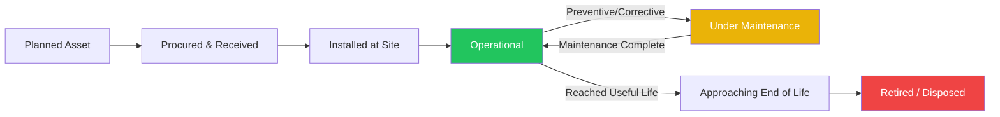
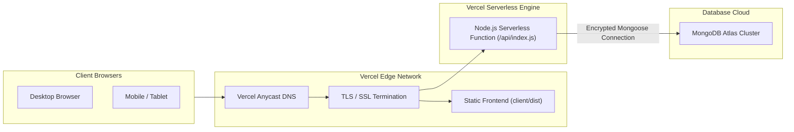

# Infrastructure Asset Lifecycle Inventory — System Architecture

## 1. System Overview & High-Level Architecture Diagram

The **Infrastructure Asset Lifecycle Inventory System** is a full-stack, cloud-ready CMMS (Computerized Maintenance Management System) built for enterprise tracking of physical and digital assets across their entire operational lifecycle (Planned → Procured → Received → Installed → Operational → Under Maintenance → End of Life → Retired).

---

## 2. Component Architecture Breakdown

### 2.1 Presentation & User Interface (Client)
- **Framework**: React 19 + Vite 6
- **Routing**: React Router v7 (`/`, `/assets`, `/assets/:id`, `/maintenance`, `/locations`)
- **Design System**: Tailwind CSS v4, dark/light modern dashboard aesthetic
- **Charts & Data Visualization**: Recharts for lifecycle distribution, condition breakdown, and financial asset valuation
- **Security Headers**: Standardized request wrapper sending `X-Requested-With: InfraTrack` security headers and CSRF tokens.

### 2.2 Server & API Services (Backend)
- **Runtime**: Node.js ES Modules with Express 5
- **Serverless Hosting**: Optimized Vercel entry point (`api/index.js`) wrapping Express middleware
- **Authentication**: JWT token in HTTP-only cookies, session management, and rate limiting (`express-rate-limit`)
- **API Endpoints**:
  - `GET /api/dashboard`: Aggregated executive operational stats, warranty alerts, and due maintenance
  - `GET /api/assets`, `POST /api/assets`, `PUT /api/assets/:id`: Complete Asset CRUD operations
  - `PATCH /api/assets/:id/lifecycle`: Immutable lifecycle state transitions with automatic audit event creation
  - `GET/POST/PUT /api/maintenance`: Maintenance job scheduling, assignment, and completion workflow
  - `POST /api/assistant`: Natural language querying powered by Groq LLM

### 2.3 Data Storage & Database Architecture
- **Primary Database**: MongoDB Atlas via Mongoose ORM
  - `assets`: Primary asset records with purchase costs, condition, criticality, warranty, and custodian metadata
  - `maintenancerecords`: Preventive & corrective maintenance tasks with technician, cost, and completion tracking
  - `assetevents`: Immutable timeline history for every asset state change
  - `locations`: Physical/logical site definitions and aggregated valuation
- **Embedded Fallback**: `better-sqlite3` with in-memory fallback for offline/development environments

---

## 3. Data Flow & Lifecycle Event Sequence

---

## 4. Maintenance & Audit Timeline Workflow

---

## 5. Deployment Topology (Vercel Cloud Deployment)

---

## 6. Summary of Key Technologies

| Layer | Technology |
| :--- | :--- |
| **Frontend Framework** | React 19, Vite 6, React Router v7 |
| **Styling & UI** | Tailwind CSS v4, Lucide React Icons |
| **Charts & Metrics** | Recharts |
| **Backend API** | Node.js (ES Modules), Express 5 |
| **Database** | MongoDB Atlas (Mongoose ORM) & SQLite Fallback |
| **AI Integration** | Groq AI API (`@langchain/groq`) |
| **Deployment Platform** | Vercel (Serverless Functions & Edge Network) |
